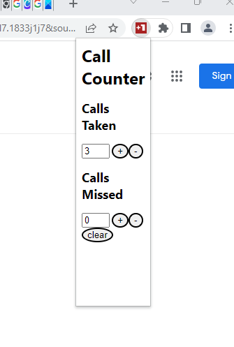

# Call-Counter

This is a simple, bare bones, chrome extension that lets a user track how many calls they've taken/missed in a support environment. 

This extension leverages the `chrome.storage.local` API's to store the counter data persistently. This was a project I wrote to learn how to best leverage this API. 

Here's an image of the extension: 



To install the extension locally: 

1. Clone this repo -

```sh 
git clone https://github.com/itonyr/chrome-extensions
``` 

2. Open the google chrome Extensions page by typing this into the URL field within Chrome
```
chrome://extensions/
```

3. Enable Developer Mode in the upper right hand corner 

4. Select 'Load Unpacked' > 'Browse' and navigate to the 'src' directory within the callcounter folder. 

This will add the extension to your web browser. 